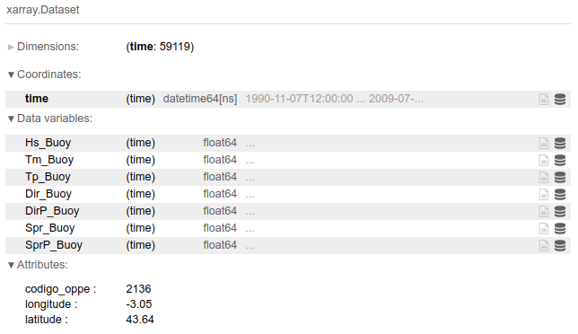
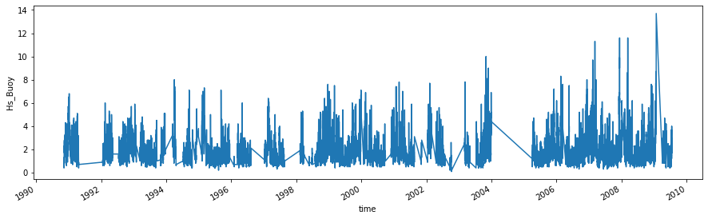

# Buoy data

The ground truth data ([buoys](https://en.wikipedia.org/wiki/Buoy)) is saved here. For this data type, the resources available are huge, and data collection might be very tricky, as different organizations structure the data in many different ways, so the acquisition and downloading of it should not be very simple. For this project, we use two different datasets.

* [bilbao-offshore-buoy](http://www.puertos.es/es-es/oceanografia/Paginas/portus.aspx): This is the `bilbao_offshore_buoy.nc` file, which contains the information of a spectral buoy located in the north of Spain. Website: [Puertos del Estado (Spanish government)](http://www.puertos.es/es-es/oceanografia/Paginas/portus.aspx).

* [oahu-nearshore-buoy](https://www.ndbc.noaa.gov/): This is the `oahu_nearshore_buoy.nc` file, which contains information of a buoy located in the north shore of Oahu, where very famous surfing spots are located. Website: [NOAA](https://www.ndbc.noaa.gov/).

Variable names might differ, so be careful when loading the datasets and performing all the calibration and validation analysis, as the code might push some errors.

**Important**: If **NO** buoy data is available, please set the parameters regarding buoy data to False at the beginning of the notebooks!!

Finally, the aspect of the spanish buoy data and its `Hs_Buoy` variable plotted:

