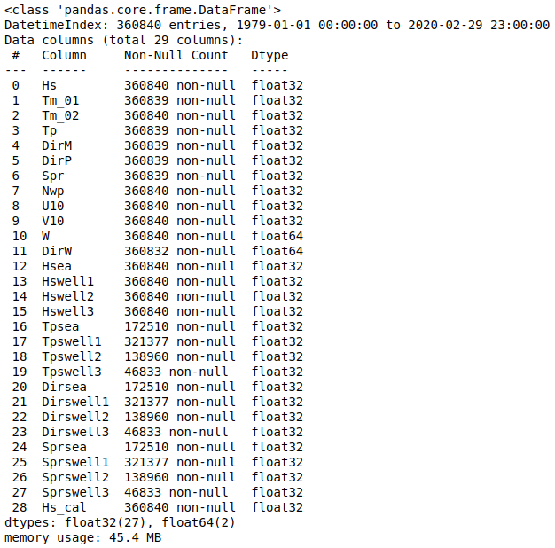
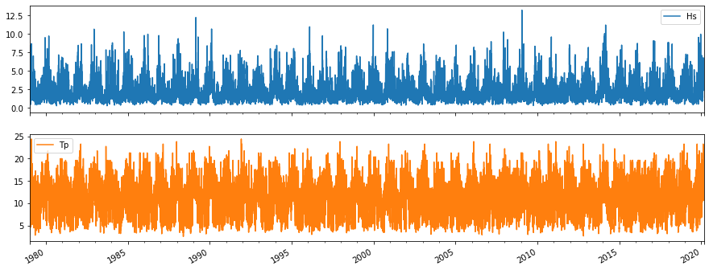

# Hindcast data

We save here all the hindcast data that is used in this wave height calibration project. The initial files, just downloaded from the csiro website and pre-processed with the `preprocess_csiro_datset.py` file available here, have a name similar to `csiro_dataframe_location.pkl`, although it can be also saved as a netcdf file, as the transformation from a pandas dataframe to a xarray dataset is very straightforward ([link](https://pandas.pydata.org/docs/reference/api/pandas.DataFrame.to_xarray.html)). Below, the structure of this pandas dataframe is shown:

where the name of the variables has been modified from the ones that csiro gives to all the oceanographic data, but here, we preferred these new, more representative names:

CalValWaves | CSIRO | Desciption | Download
:---: | :---: | :--- | :---:
Hs | hs | Significant height of wind and swell waves | Yes
Tm_01 | t01 | Mean period T01 | Optional
Tm_02 | t02 | Mean period T02 | Optional
Tp | 1 / fp | Wave peak frequency | Yes
DirM | dir | Wave mean direction | Yes
DirP | dp | Peak direction | Yes
Spr | spr | Wave directional spread | Yes
Nwp | pnr | Number of wave partitions | Optional
U10 | uwnd | Eastward wind component | Optional
V10 | vwnd | Northward wind component | Optional
Hsea | phs0 | Wave significant height partition 0 | Yes
Tpsea | ptp0 | Peak direction partition 0 | Yes
... | ... | ... | ... 
Hs_cal | None | This is the total Hs calculated from partitions | None

where **not all the variables** are going to be used, and some variables such us the wind and its velocity (W, DirW), are calculated in the `preprocess_csiro_datset.py` file. Although not all the variables are used in the **CalValWaves** project, we recommend the download of all these variables, as they can be used in other related projects such as the [DeliWaves](https://github.com/javitausia/DeliWaves) project, where all the data used in this repository, plus the corrected hindcast, here named `csiro_dataframe_location_sat_corr.pkl`, which is the main goal of the work, will be used.

Moreover, two time series plots are shown, so the continuos aspect of the data can be easily seen:

