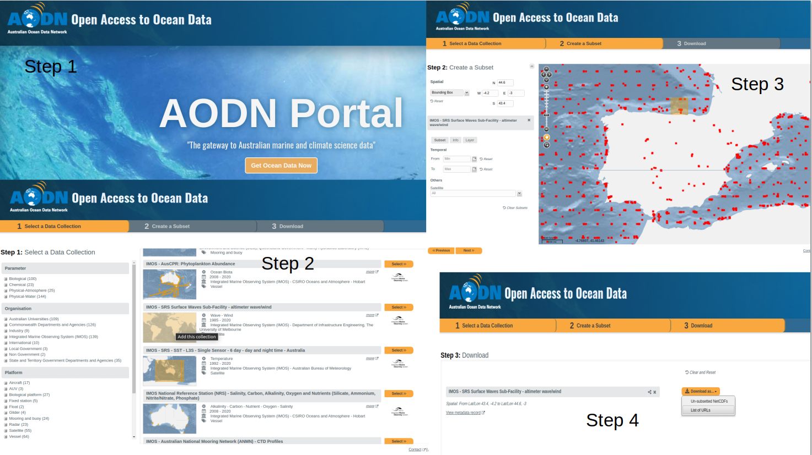
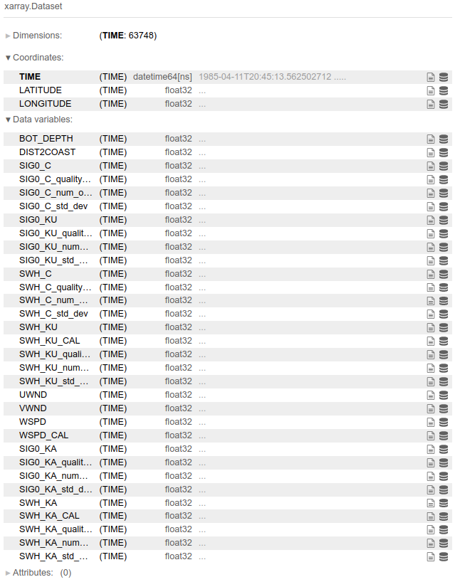

# Satellite data

All the altimeter files and the concatenated netcdf datasets are stored here, for all the locations of interest, in this case, just the Oahu and Cantabria files are saved. File names are very straightforward, and the `concat_satellite_files.py` file is also available for pre-processing help.

For the data downloading, the steps are explained below (detailed explanation [here](https://github.com/javitausia/CalValWaves#2-data-download)):

Once the data is downloaded and concatenated in a single xarray dataset, the aspect of the data should be something similar to the image below:

where a lot of variables appear, but just the **significant wave height of altimeter waves** is used, named as `SWH_KU` or `SWH_KA`!!
